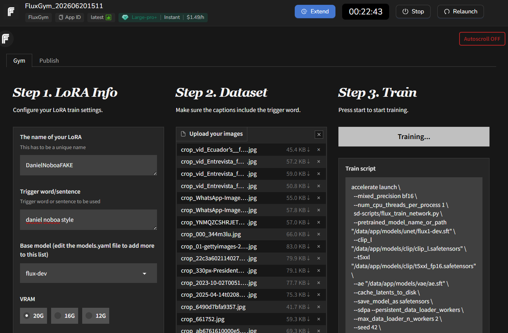
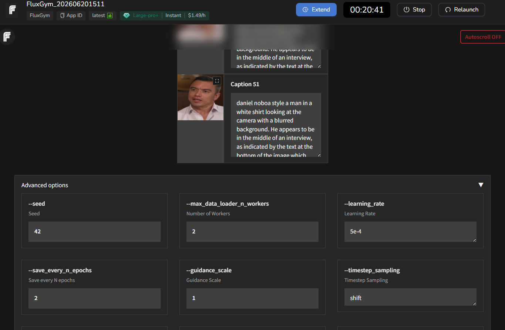
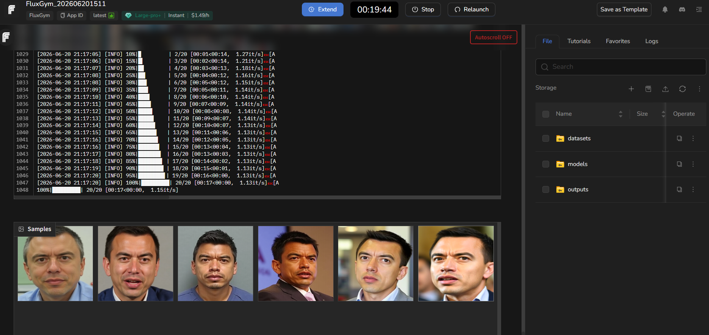
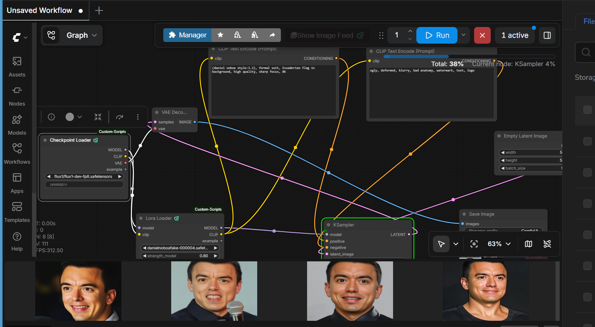

# Ecuadorian Political Deepfake Dataset

## Overview

A balanced dataset of **1,462 facial images** of four Ecuadorian political figures, designed for deepfake detection research.

| Subset | Count |
|--------|-------|
| Real images | 731 |
| Synthetic images (FLUX.1-dev + LoRA) | 731 |
| **Total** | **1,462** |

## Political Figures

| Politician | Real | Fake | Total |
|-----------|------|------|-------|
| Daniel Noboa | 231 | 231 | 462 |
| Rafael Correa | 100 | 100 | 200 |
| Guillermo Lasso | 200 | 200 | 400 |
| Luisa Gonzalez | 200 | 200 | 400 |
| **Total** | **731** | **731** | **1,462** |

## Synthetic Image Generation Pipeline

The fake images were generated using a two-phase pipeline: **LoRA fine-tuning with FluxGym** followed by **inference with ComfyUI**.

---

### Phase 1 — LoRA Training with FluxGym

[FluxGym](https://github.com/cocktailpeanut/fluxgym) is a user-friendly web UI built on top of **SimpleTuner** that allows training FLUX.1 LoRA adapters without writing code.

**Training configuration:**

| Parameter | Value |
|-----------|-------|
| Base model | `FLUX.1-dev` |
| Adapter type | LoRA |
| Rank | 32 |
| Alpha | 32 |
| Training platform | MimicPC (cloud GPU) |
| Training images per politician | 20–30 curated facial images |
| Trigger word | Politician's name (e.g., `danielnoboa`) |

**Training process:**
1. A set of 20–30 real facial images was curated per politician.
2. Images were captioned automatically and uploaded to FluxGym.
3. A LoRA adapter was trained for each politician separately.
4. The resulting `.safetensors` file encodes the politician's facial identity.

**Step 1 — LoRA configuration and dataset upload in FluxGym:**



*Left: LoRA info configuration (name, trigger word, base model). Center: training images uploaded to FluxGym. Right: the generated `accelerate launch` training script with FLUX.1-dev model paths.*

**Step 2 — Auto-captioning and advanced training parameters:**



*FluxGym automatically generates descriptive captions for each training image, prepending the trigger word (`daniel noboa style`). Advanced options include learning rate, guidance scale, and timestep sampling strategy.*

**Step 3 — Training progress and intermediate samples:**



*Training log showing completion of 20 steps on MimicPC (Large-pro+ GPU). The Samples panel at the bottom displays intermediate generations used to monitor LoRA quality during training.*

---

### Phase 2 — Image Inference with ComfyUI

[ComfyUI](https://github.com/comfyanonymous/ComfyUI) is a node-based workflow tool for diffusion models. The trained LoRA was loaded alongside FLUX.1-dev to generate synthetic facial images.

**Inference configuration:**

| Parameter | Value |
|-----------|-------|
| Base model | `FLUX.1-dev` |
| LoRA adapter | Politician-specific (rank=32) |
| Sampling steps | 28 |
| CFG scale | 7.0 |
| Output resolution | 1024×1024 px |
| Post-processing | MTCNN face crop → bicubic resize to 512×512 |

**Inference process:**
1. The politician's LoRA adapter was loaded into ComfyUI.
2. A text prompt describing a neutral frontal portrait was used (e.g., `"a photo of danielnoboa, looking at the camera, neutral expression"`).
3. Each run produced one synthetic image at 1024×1024 px.
4. Images were then cropped to the face region (MTCNN) and resized to 512×512 px to match the real images.



*The ComfyUI graph shows the full inference pipeline: `flux1-dev-fp8.safetensors` as the base checkpoint, `danielnoboafake-000004.safet...` as the politician LoRA (strength=0.80), a positive prompt encoding the target style, and the KSampler producing 4 output images per batch.*

---

### Generation Summary

| Step | Tool | Output |
|------|------|--------|
| 1. Real image collection | Web scraping + video extraction | ~20–30 images/politician |
| 2. LoRA training | FluxGym (MimicPC) | `.safetensors` LoRA adapter |
| 3. Synthetic image generation | ComfyUI + FLUX.1-dev | 1024×1024 PNG images |
| 4. Face preprocessing | MTCNN + bicubic resize | 512×512 final images |

## Preprocessing Pipeline

| Step | Details |
|------|---------|
| Face detection | MTCNN (confidence >= 0.85) |
| ROI expansion | 1.8w x 1.9h |
| Normalization | Bicubic scaling to 512x512 px |

## Dataset Splits

| Split | Images | Percentage |
|-------|--------|------------|
| Train | 1,139 | 77.9% |
| Validation | 203 | 13.9% |
| Test | 120 | 8.2% |

## Directory Structure

```
ecuadorian-political-deepfake-dataset/
├── README.md
├── metadata.csv
├── dataset_info.json
└── data/
    ├── real/
    │   ├── noboa/       (231 images)
    │   ├── correa/      (100 images)
    │   ├── lasso/       (200 images)
    │   └── gonzalez/    (200 images)
    └── fake/
        ├── noboa/       (231 images)
        ├── correa/      (100 images)
        ├── lasso/       (200 images)
        └── gonzalez/    (200 images)
```

## Metadata CSV Schema

| Column | Description |
|--------|-------------|
| `file_path` | Relative path to the image from the repo root |
| `label` | `real` or `fake` |
| `politician` | Short key: `noboa`, `correa`, `lasso`, `gonzalez` |
| `split` | `train`, `val`, or `test` |
| `source` | `web_scraping`, `video_extraction`, or `FLUX1_LoRA` |
| `resolution` | Stored image resolution (`512x512`) |

## Usage Example

```python
import pandas as pd
from PIL import Image

df = pd.read_csv('metadata.csv')
train_df = df[df['split'] == 'train']

# Load an image
img = Image.open(train_df.iloc[0]['file_path'])
```

## Citation

If you use this dataset in your research, please cite:

```bibtex
@dataset{ecuadorian_deepfake_2026,
  title  = {Ecuadorian Political Deepfake Dataset},
  year   = {2026},
  note   = {Citation will be updated after publication - TICEC 2026}
}
```

## License

This dataset is released under the [MIT License](LICENSE).
